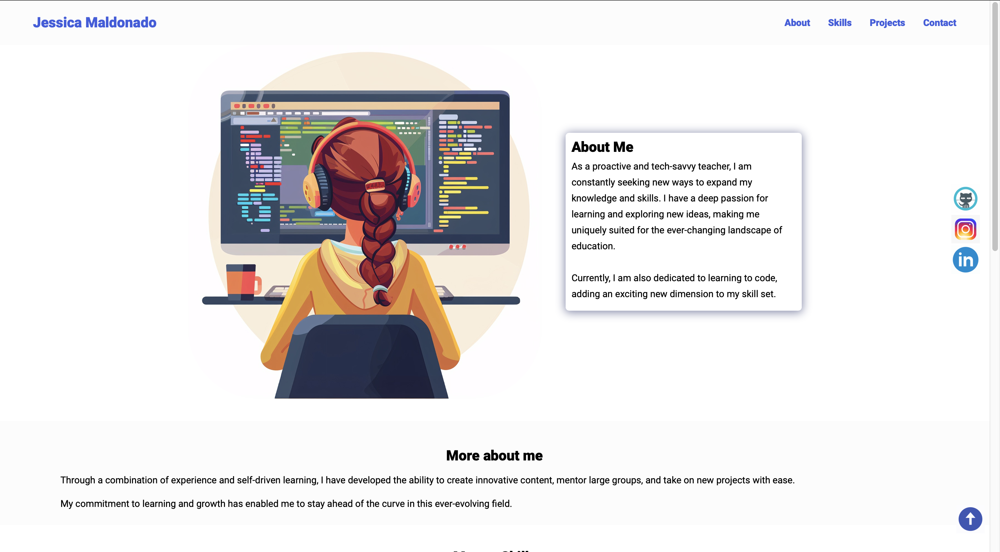

# jezikma.github.io

# Portafolio 
Este proyecto es un proyecto creado con HTML5 y CSS3, implementando el uso de flexbox y un poco de JS.

### Características

* **Diseño Responsive:** Adaptable a diferentes de tamaños de pantalla para una experiencia de usuario óptima en dispositivos móviles y de escritorio.
  
* **Interacciones Dinámicas:** Efectos visuales para elementos interactivos como botones y enlaces.👽🤓
  
* ### Tecnologías Utilizadas
+ **HTML5:** Para la estructura básica del sitio.
+ **CSS3:** Para el diseño y el estilo, incluyendo _flexbox_ para un diseño responsivo y efectos de _hover_.
+ **JS:** Para el diseño _responsive_.
+ **Google Fonts:** Para fuentes personalizadas.

### Vista Previa del Proyecto

### Contacto
Si te gustaría invitarme a colaborar en un proyecto, escríbeme por [LinkedIn](https://www.linkedin.com/in/jessica-malc/).
